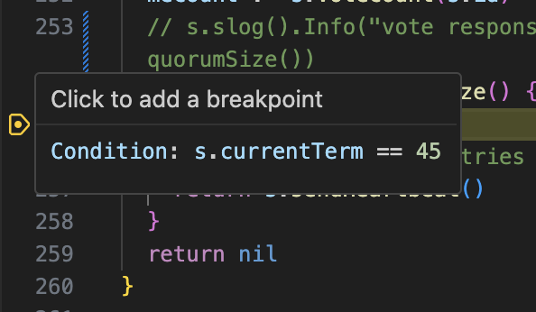

# First Successful Bug Squash

I'm writing this up for a quick 5 min presentation at [Recurse](https://www.recurse.com).

---

## Testing Distributed Systems

- I'm implementing the Raft consensus protocol in Go.
- As a testbed for exploring techniques for repeatable, deterministic testing of distributed systems.
- Motivation: testing edge cases in distributed systems can be really hard.
  - Like: network issues, disk issues, deadlocks, livelocks.
  - Many bugs don't show up until production, because our test frameworks aren't good enough. So your customers are your test framework.
  - If you are lucky, you can reproduce the bug some small fraction of the time. Often you can't consistently reproduce at all, and just have to hope you are right about the cause and that your fix works.
  - If you are wrong and the bug re-appears, you get to do it all over again!

<!-- Hi I'm Brian -->
<!-- I'm back again with another project. I'm not sure this one is going to demo very well. Bear with me while I try anyway. -->

---

## Raft Protocol

https://raft.github.io/

It all fits on one page, except for the parts that don't.

<!-- I'm not going to talk about the Raft protocol right now, but I'm happy to talk it over later with anybody who is interested. -->

---

## Advancements in Testing

- A lot of new techniques have been developed in the last 10 years. I want to explore some of them.
- Deterministic, repeatable testing of distributed systems is my current focus.

---

## In-Memory Raft Cluster

- Developing a repeatable test framework.
- Randomize the runs and check that invariants hold.

---

## Finding a Bug

- At first, no leader election bugs found over tens of thousands of runs.

- Yay! 🎉
- Yay? 🤔
- But: let's simulate networking delays and drops.
  - That's always a ripe area for distributed systems bugs.

---

# Network Fault Injection

---

# Delaying Messages Between Nodes

---

# We Found a 🐞!

- In about 3 minutes.
- And the test case is reproduceable! Just pass in `TEST_SEED=2138277653`

---

# Debugger Magic

- We could add a bunch of logging and tracing.
- But, since we can reproduce the bug, we can also just... debug it.

- We can even set a condition on the breakpoint, because we know the term where the bug was found!
- I hope this is half as exciting to some of you as it is to me.

---

<!-- Wait a minute, we are on term 45. It just counted a vote for term 41. -->

---

# Fixed

- Once we can use the debugger, the fix takes seconds.
- This condition is implied by the Raft one-page summary, but not mentioned explicitly.
- My bad.

---

# Time to verify the fix

- Red to green in minutes. 🥳

---

# Next Steps

- Come talk to me!
- Would love to chat, pair, mob, argue, whatevs.
- Let's explore more ways to make distributed systems testing and verification better.
